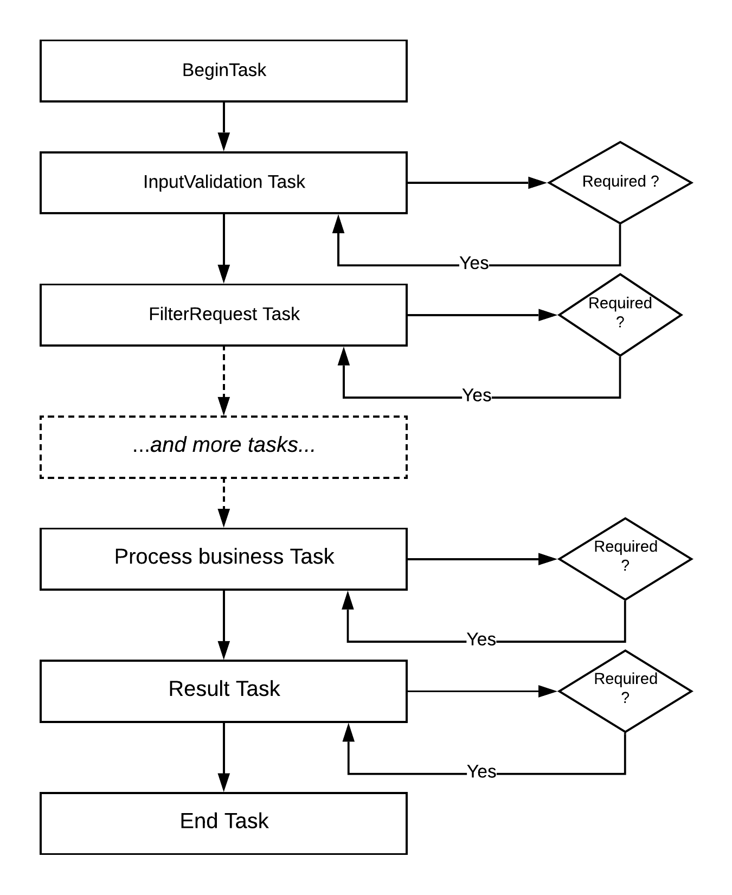

# Chain of Responsibility Design pattern

## Introduction
Chain of Responsibility is a behavioral design pattern that lets you pass requests 
along a chain of handlers. Upon receiving a request, each handler decides either 
to process the request or to pass it to the next handler in the chain.

Using this pattern makes the code more composable, less coupling, and eliminate the 
need for mocking objects.

Ref: https://en.wikipedia.org/wiki/Chain-of-responsibility_pattern

## Implementation
Scope of this project is to provide sample implementation of chain of responsibility 
design pattern taking singly linked list approach. This sample can be easily extended 
to take doubly linked list approach so that handling the request can be reverse at any 
point of time if required.

Every individual handler in implementation is known as `task` object.

Main class: BusinessEntryPoint

## Design

